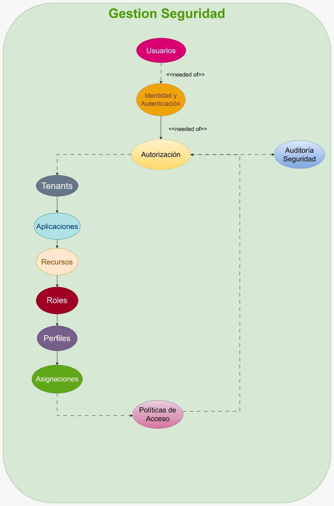

# Bounded Contexts

| Campo | Valor |
|---|---|
| Estado | Accepted (v1.0) |
| Fase | 0.B |
| Diagrama autoridad | [`diagrams/02-bounded-contexts.png`](diagrams/02-bounded-contexts.png) |
| Big Picture | [`diagrams/01-big-picture.png`](diagrams/01-big-picture.png) |

## Principio

Los contextos delimitados representan **capacidades de negocio** del dominio `Gestion Seguridad`, no capas técnicas. En implementación se proyectan a módulos Spring Modulith (pueden agruparse si el Dependency Map lo justifica; no se fusionan en el modelo de dominio sin ADR).

## Contextos (autoridad del diagrama)

| ID | Contexto | Responsabilidad | Modelo visual | No es responsable de |
|---|---|---|---|---|
| BC-01 | **Tenants** | Partición organizacional y configuración aplicable. | [01-tenants](diagrams/models/01-tenants.png) | Autorizar solicitudes; gestionar identidades. |
| BC-02 | **Aplicaciones** | Registrar apps que delegan seguridad y su vínculo a tenants. | [02-aplicaciones](diagrams/models/02-aplicaciones.png) | Evaluar políticas; definir roles. |
| BC-03 | **Recursos** | Elementos protegibles y jerarquía app→módulo→funcionalidad→acción. | [03-recursos](diagrams/models/03-recursos.png) | Decidir si un sujeto puede acceder. |
| BC-04 | **Roles** | Catálogo RBAC de roles y su vínculo a recursos/acciones. | [04-roles](diagrams/models/04-roles.png) | Asignar roles a usuarios; evaluar OPA. |
| BC-05 | **Perfiles** | Agrupación de roles para administración. | [05-perfiles](diagrams/models/05-perfiles.png) | Vigencia de asignaciones; enforcement. |
| BC-06 | **Usuarios** | Sujeto de dominio (persona/cuenta interna) y su estado. | [06-usuarios](diagrams/models/06-usuarios.png) | Autenticar contra IdP; autorizar. |
| BC-07 | **Identidad y autenticación** | Credenciales, proveedor, sesión, evidencia JWT/claims normalizados. | [07-identidad](diagrams/models/07-identidad-autenticacion.png) | Autorizar; persistir tokens completos en auditoría. |
| BC-08 | **Asignaciones** | Materializar privilegios vigentes (usuario–app–rol, perfiles, pendientes, planes). | [08-asignaciones](diagrams/models/08-asignaciones.png) | Definir catálogo de roles; evaluar OPA. |
| BC-09 | **Políticas de acceso** | Metadatos y estructura de políticas (`Politica` → `ReglaPolitica` → `CondicionPolitica`); versionado. | [09-politicas](diagrams/models/09-politicas-acceso.png) | Ejecutar Rego (OPA); aplicar decisión (PEP). |
| BC-10 | **Autorización** | Flujo de evaluación: `InterceptorAcceso` → `SolicitudAcceso` → `MotorAutorizacionOPA` → `DecisionAcceso` → `EventoAcceso`. | [10-autorizacion](diagrams/models/10-autorizacion.png) | Administrar catálogos; ser el IdP. |
| BC-11 | **Auditoría de seguridad** | Evidencia correlacionada de decisiones y operaciones sensibles. | [11-auditoria](diagrams/models/11-auditoria-seguridad.png) | Tomar decisiones; `HashBlockchain` (no requisito). |

## Lectura del diagrama de contextos

Del [`02-bounded-contexts.png`](diagrams/02-bounded-contexts.png):

1. **Cadena de necesidad:** `Usuarios` → `Identidad y autenticación` → `Autorización`.
2. **Estructura de control de acceso:** desde `Autorización` se necesitan `Tenants` → `Aplicaciones` → `Recursos` → `Roles` → `Perfiles` → `Asignaciones`.
3. **Políticas:** `Asignaciones` (y el resto del contexto de control) alimentan `Políticas de acceso`.
4. **Trazabilidad:** `Autorización` y `Políticas de acceso` conectan a `Auditoría de seguridad`.

## Relación con Documento Base §11

El Documento Base agrupaba algunos de estos contextos (p. ej. Roles+Perfiles, Usuarios dentro de Identidad, Autorización dentro de Políticas). **Los diagramas v0.2 son la autoridad de partición**; el Documento Base sigue siendo autoridad de decisiones tecnológicas y principios. Si se desea re-agrupar para Modulith, se documenta en el Dependency Map (0.C) sin borrar el BC de dominio.

## Proyección tentativa a contenedores C4

| Contenedor (C4 L2) | Contextos que orquesta / posee en runtime |
|---|---|
| PEP | Parte de Autorización (interceptor / enforcement) — sin políticas ni datos |
| PDP | Autorización (evaluación) + lectura de Usuarios/Identidad/Tenants/Apps/Recursos/Roles/Perfiles/Asignaciones/Políticas |
| OPA | Ejecución de políticas (fuera del dominio de catálogo) |
| SurrealDB | Persistencia de los BC de catálogo + referencias de auditoría |
| Servicio de auditoría | Auditoría de seguridad |

## Criterio de cierre

- [x] Contextos alineados al diagrama `02-bounded-contexts.png`.
- [x] Cada contexto tiene modelo visual en `diagrams/models/`.
- [x] Separación explícita Autorización vs Políticas de acceso vs Identidad vs Usuarios.

---

## Navegación

[**← 02 Lenguaje ubicuo**](02-ubiquitous-language.md) · [**04 Context Map →**](04-context-map.md)
