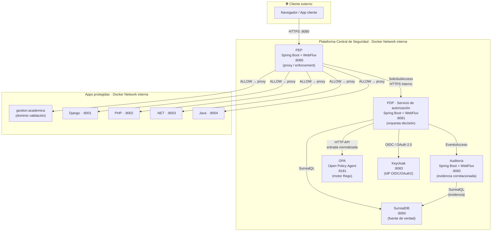

# Deployment — MVP (Fase 0 / Etapa 1)

| Campo | Valor |
|---|---|
| Estado | Accepted (v1.0) |
| Fase | 0.C |
| Principio | Cloud Enable — Docker desde el inicio; preparado para Kubernetes sin reescritura |
| ADR | ADR-010 · ADR-013 (Keycloak) · ADR-014 (HTTP mapping) |
| Fuentes | C4 L2 [`../c4/level2-containers.png`](../c4/level2-containers.png); Documento Base §6, §8.3, §19 |
| App de validación | Gestión Académica Universitaria — [`../../02-domain/01-validation-application.md`](../../02-domain/01-validation-application.md) |

---

## Topología MVP (Docker Compose)



---

## Servicios y responsabilidades

| Servicio | Imagen base | Puerto expuesto | Puerto interno | Responsabilidad |
|---|---|---|---|---|
| `pep` | `eclipse-temurin:21` (app jar) | `8080` | `8080` | Interceptar, normalizar y aplicar decisión |
| `pdp` | `eclipse-temurin:21` (app jar) | — (interno) | `8081` | Orquestar evaluación, único acceso a OPA/DB/IdP |
| `auditoria` | `eclipse-temurin:21` (app jar) | — (interno) | `8082` | Persistir y exponer evidencia correlacionada |
| `opa` | `openpolicyagent/opa:latest-rootless` | — (interno) | `8181` | Evaluar Rego |
| `surrealdb` | `surrealdb/surrealdb:latest` | — (interno) | `8000` | Datos del dominio de seguridad |
| `keycloak` | `quay.io/keycloak/keycloak` | — (interno; admin UI opcional en lab) | `8083` | IdP OIDC/OAuth2 del MVP (ADR-013) |
| `gestion-academica` | (app de validación) | — (interno) | (por definir) | Dominio de negocio de validación (PD-01) |
| `app-django` | (demo) | — (interno) | `8001` | App protegida de referencia (Python/Django) |
| `app-php` | (demo) | — (interno) | `8002` | App protegida de referencia (PHP) |
| `app-dotnet` | (demo) | — (interno) | `8003` | App protegida de referencia (.NET) |
| `app-java` | (demo) | — (interno) | `8004` | App protegida de referencia (Java) |

**Solo el PEP** expone puerto al exterior (`8080`). El resto se comunica por la red interna de Docker. Esto no cambia en Kubernetes (se convierte en `ClusterIP`/`NodePort`/`Ingress` según la decisión de Cloud Enable).

---

## Restricciones Cloud Enable aplicadas

| Restricción (ADR-010) | Cómo se cumple en este deployment |
|---|---|
| Sin host fijo | Todos los servicios referenciados por nombre de servicio Docker, no por IP |
| Sin estado en filesystem local | SurrealDB usa volumen Docker nombrado; bundles Rego montados como volumen o imagen — no ruta fija del host |
| Config / secretos externos al artefacto | Variables de entorno obligatorias (ver sección siguiente); sin valores en la imagen |
| Paridad dev ↔ CI | El mismo `docker-compose.yml` usado en desarrollo y en pipeline CI |
| Procesos desechables | Servicios Java sin estado propio; SurrealDB con volumen persistente nombrado |

---

## Variables de entorno (convención 12-Factor)

Ningún secreto ni endpoint se incrusta en el artefacto. Se inyectan al contenedor:

| Variable | Servicio | Descripción |
|---|---|---|
| `PDP_URL` | pep | URL interna del servicio pdp |
| `OPA_URL` | pdp | URL del servicio opa (`http://opa:8181`) |
| `SURREALDB_URL` | pdp, auditoria | URL de SurrealDB (`ws://surrealdb:8000`) |
| `SURREALDB_USER` | pdp, auditoria | Usuario SurrealDB (secreto) |
| `SURREALDB_PASS` | pdp, auditoria | Contraseña SurrealDB (secreto) |
| `SURREALDB_NS` | pdp, auditoria | Namespace |
| `SURREALDB_DB` | pdp, auditoria | Base de datos |
| `IDP_ISSUER_URL` | pdp | Issuer Keycloak (`http://keycloak:8083/realms/<realm>`) |
| `IDP_AUDIENCE` | pdp | Audience / client-id esperado |
| `IDP_JWKS_URL` | pdp | JWKS de Keycloak (validación de firma) |
| `AUDIT_SERVICE_URL` | pdp | URL interna del servicio de auditoría |
| `OPA_BUNDLE_PATH` | opa | Ruta al bundle de políticas Rego (volumen) |

**Secretos** (`SURREALDB_PASS`, credenciales IdP) se suministran vía `.env` local en desarrollo y vía secret manager (Kubernetes Secrets / Vault) en producción. Nunca en el `Dockerfile` ni en la imagen.

---

## Estructura mínima `docker-compose.yml` (esqueleto)

```yaml
# Este es un esqueleto de referencia — no una implementación lista para producción.
# Se elabora en la Etapa 0.G (ingeniería de construcción).

version: "3.9"

networks:
  plataforma-net:
    driver: bridge

volumes:
  surrealdb-data:
  opa-bundles:

services:

  pep:
    build: ./pep
    ports:
      - "8080:8080"
    environment:
      - PDP_URL=http://pdp:8081
    networks:
      - plataforma-net
    depends_on:
      - pdp

  pdp:
    build: ./pdp
    environment:
      - OPA_URL=http://opa:8181
      - SURREALDB_URL=ws://surrealdb:8000
      - SURREALDB_USER=${SURREALDB_USER}
      - SURREALDB_PASS=${SURREALDB_PASS}
      - SURREALDB_NS=${SURREALDB_NS}
      - SURREALDB_DB=${SURREALDB_DB}
      - IDP_ISSUER_URL=${IDP_ISSUER_URL}
      - IDP_AUDIENCE=${IDP_AUDIENCE}
      - AUDIT_SERVICE_URL=http://auditoria:8082
    networks:
      - plataforma-net
    depends_on:
      - opa
      - surrealdb
      - auditoria

  auditoria:
    build: ./auditoria
    environment:
      - SURREALDB_URL=ws://surrealdb:8000
      - SURREALDB_USER=${SURREALDB_USER}
      - SURREALDB_PASS=${SURREALDB_PASS}
      - SURREALDB_NS=${SURREALDB_NS}
      - SURREALDB_DB=${SURREALDB_DB}
    networks:
      - plataforma-net
    depends_on:
      - surrealdb

  opa:
    image: openpolicyagent/opa:latest-rootless
    command: run --server --addr 0.0.0.0:8181 /bundles
    volumes:
      - opa-bundles:/bundles
    networks:
      - plataforma-net

  surrealdb:
    image: surrealdb/surrealdb:latest
    command: start --user ${SURREALDB_USER} --pass ${SURREALDB_PASS} file:/data/surreal.db
    volumes:
      - surrealdb-data:/data
    networks:
      - plataforma-net

  keycloak:
    image: quay.io/keycloak/keycloak:latest
    command: start-dev
    environment:
      - KEYCLOAK_ADMIN=${KEYCLOAK_ADMIN}
      - KEYCLOAK_ADMIN_PASSWORD=${KEYCLOAK_ADMIN_PASSWORD}
      - KC_HTTP_PORT=8083
    networks:
      - plataforma-net

  # --- App de validación de dominio + demos tecnológicas ---
  gestion-academica:
    build: ./demo/gestion-academica
    networks:
      - plataforma-net

  # --- Apps de referencia tecnológica ---
  app-django:
    build: ./demo/django
    networks:
      - plataforma-net
  app-php:
    build: ./demo/php
    networks:
      - plataforma-net
  app-dotnet:
    build: ./demo/dotnet
    networks:
      - plataforma-net
  app-java:
    build: ./demo/java
    networks:
      - plataforma-net
```

---

## Flujo de red en el deployment

```text
[Cliente] ──HTTPS:8080──► [PEP]
                              │ SolicitudAcceso (HTTP interno)
                              ▼
                           [PDP] ──HTTP──► [OPA:8181]  (evaluación Rego)
                              │   ──SurrealQL──► [SurrealDB:8000]  (contexto)
                              │   ──OIDC/OAuth──► [IdP externo]  (validación)
                              │   ──HTTP──► [Auditoría:8082]  (EventoAcceso)
                              │
                       DecisionAcceso
                              │
              ┌───────────────┴──────────────┐
           ALLOW                           DENY / INDETERMINATE
              │                                     │
              ▼                                     ▼
   [App protegida :800x]             Respuesta controlada al cliente
                                     (403 Forbidden / 503 según causa)
```

---

## Camino hacia Kubernetes (Cloud Enable)

| Docker Compose | Kubernetes equivalente |
|---|---|
| Service name resolution | `ClusterIP` Service |
| Puerto externo `8080` PEP | `Ingress` / `LoadBalancer` |
| Volumen `surrealdb-data` | `PersistentVolumeClaim` |
| Variables de entorno `.env` | `Secret` + `ConfigMap` |
| `depends_on` | `readinessProbe` + `livenessProbe` |
| Un solo `docker-compose.yml` | Helm Chart / Kustomize overlay |

No se requiere cambio de código para esta migración: es consecuencia directa de Cloud Enable (ADR-010).

---

## Criterio de cierre (0.C Deployment)

- [x] Topología MVP definida y justificada.
- [x] Solo PEP expuesto al exterior.
- [x] Variables de entorno catalogadas, sin secretos en imagen.
- [x] Camino a Kubernetes documentado.
- [ ] `docker-compose.yml` real en el repositorio de implementación (Etapa 0.G).
- [ ] Prueba técnica de WebFlux documentada como anexo (Documento Base §19 Etapa 0).
