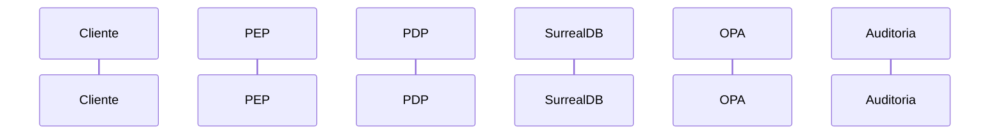

# SEQ-XXX: Título del flujo

| Campo | Valor |
|---|---|
| ID | SEQ-XXX |
| Escenario | ALLOW / DENY / INDETERMINATE / Otro |
| Actores | Cliente, PEP, PDP, OPA, SurrealDB, Auditoría, IdP |
| Relacionado | UC-XXX |

## Descripción

## Diagrama

## Notas

-

## Evidencia de auditoría

-
